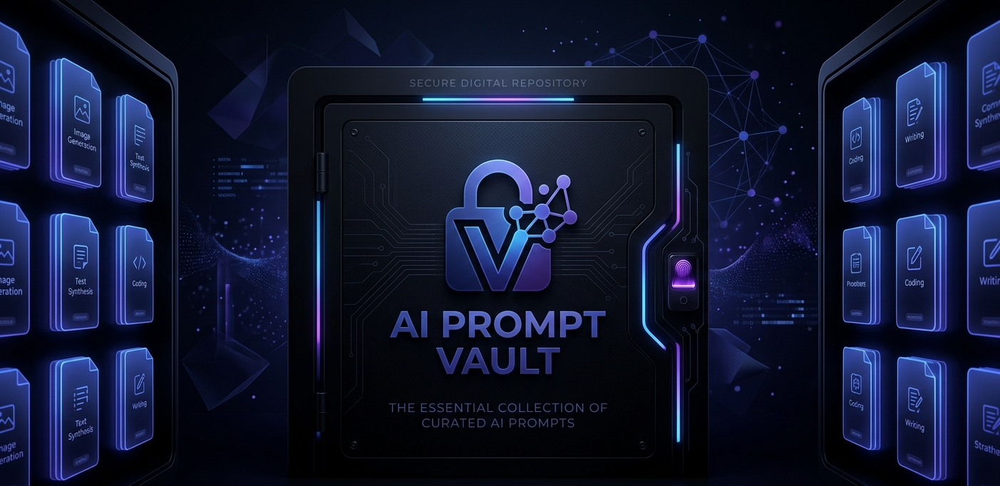

# PromptVault: Organized Platform for Managing Prompt Collections





## What it is

PromptVault treats prompts as first-class artefacts. Each primpt is a Jinja2 template with named variables, a version history, and structured metadata. You store them, render them with context, track changes over time, and retrieve them by tag or content.


## Core features

- **Jinja2 rendering** - store prompts as templates (`{{ variable_name }}`), fill variables at render time, obtain full output directly
- **Version history** - every edit creates a new version; full diff view between any two versions
- **CRUD with metadata** - title, description, tags, prompt template body; edit without losing history
- **Tag-based retrieval** - exact-match tag filtering and full-text search across title, body, and description
- **Bulk import/ export** - CSV and JSON round-trip for migrating existing prompt libraries


## Architecture

```
app.py (Streamlit UI)
    └── core/
        ├── renderer.py     # Jinja2 rendering
        └── crud.py
    └── db/
        └── session.py      # SQLite conn and session management
    └── models/
        └── prompt.py       # SQLAlchemy ORM model + Pydantic schema
    └── api/
        └── routes.py       # FastAPI layer (WIP)
```
<br></br>

| Component        | Technology           | Purpose                               |
|------------------|---------------------|----------------------------------------|
| **Frontend**     | Streamlit           | Interactive prompt management UI       |
| **Rendering**    | Jinja2              | Template variable substitution         |
| **Database**     | SQLite              | Local persistent storage               |
| **ORM**          | SQLAlchemy          | Model definitions and query layer      |
| **Validation**   | Pydantic            | Schema validation and settings         |
| **API**          | FastAPI             | Programmatic access (WIP)              |

<br></br>

## Roadmap / TODO

- [ ] FastAPI layer for programmatic access and CI/CD integration
- [ ] Postgres backend option for shared/team use
- [ ] Prompt chaining (compose outputs of one prompt as inputs to another)
- [ ] Usage analytics (render counts, last used, variable frequency)
- [ ] User authentication for multi-user deployments

---

Made with [Streamlit](https://streamlit.io/) · [Jinja2](https://jinja.palletsprojects.com/)